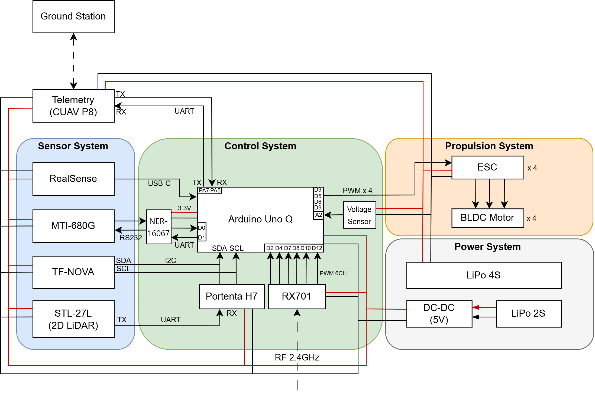

# Autonomous Drone Development

This is the team archive for our 2026 autonomous-vehicle control project. The platform combines an Arduino Uno Q flight controller, onboard sensing, a ground-control station and a camera for helipad detection.

[Watch the flight demonstration](https://www.youtube.com/watch?v=GLonDTGTSmQ).

## Project goal

Build and evaluate a team quadrotor platform that combines sensing, control, autonomous missions, vision and a ground station.


AI-generated concept illustration. Device appearance, interface layout and example graphics are illustrative, not project photographs or measured results.

## Where it could be used

The platform can be read as an integration example for robotics education: sensing, flight-control software, mission logic, vision and a ground station must exchange usable information. It could also provide a starting point for supervised autonomy experiments on a comparable educational platform. The documented tests define the demonstrated scope; possible uses do not imply that precision landing or unrestricted autonomous operation was completed.

## At a glance


Overview reconstructed from the documented project and code. Results and verification limits are described below. [SVG](docs/flowcharts/autonomous.svg)

## Project configuration and team

The aircraft combines a physical platform, control models, flight firmware, autonomous missions, vision and a ground-control station. The team divided the work as follows.

| System component | Work | Team members |
|---|---|---|
| Aircraft hardware | Structure, component placement, assembly and wiring | 김예준, 임은결, 전세인 |
| Dynamics and measurements | Modelling and measurement of aircraft characteristics | 이은석 |
| Control design | Controller design and simulation | 이은석, 김유민, 이다원 |
| Flight firmware | Sensor processing and flight-control integration | 김예준 |
| Autonomous missions | Mission and path behaviour | 김예준 |
| Vision | Data, detection and tracking, relative target information and its interface to flight control | Sangheon Park (박상헌) |
| Ground-control station | Communication, mission interface, state display and logging | 이재용 |
| Test and result consolidation | Each member documented their subsystem; 전세인 coordinated the combined results | Team, coordinated by 전세인 |

The detector and tracker are in the [RealSense vision repository](https://github.com/oldprize47-SH/realsense-drone-vision). This archive contains the [companion bridge](flight-controller/companion-vision-bridge/main.py), which starts the separately deployed tracker and forwards its output. AI coding tools supported parts of the vision implementation and experiments. The fork preserves the original team archive and its author history.

## How the components connect

The team's hardware diagram places the sensors, Uno Q controller, propulsion, power supply and ground station in one system. Sensor measurements feed the controller, and controller outputs reach the motor drivers. The ground station exchanges commands and status with the aircraft. The camera has its own processing path before its observations enter flight control.



The report's vision flow follows RGB/depth input through detection, tracking and target-information preparation. It then crosses an interface into the controller, which checks the observation before using it. This makes the division between the vision work and flight-control work visible.


These are the team's original diagrams. They explain the intended structure and interface; the flight results below describe what the tests actually demonstrated.

## Understanding the archive

There are several separate parts to the team system. The onboard firmware reads sensors and runs the aircraft's control logic. The ground-control station is the desktop interface used to communicate with the system and inspect its state. The camera pipeline supplies target observations through a companion bridge. A successful test of one part is not automatically a successful integrated flight.

To follow the vision component, begin with the linked RealSense repository, then read the companion bridge here to see where its output enters the team system. For the wider project, start with the final report and compare its discussion with the saved experiment plots. The firmware and ground-station folders provide implementation context, with the original team authorship preserved.

During the vision work, the practical issue was not only detecting a helipad in an image. The vision component also required prepared data, a model suited to the onboard computer, comparisons of detection and tracking approaches, and checks that the relative-position information and validity state were usable by the flight-control team. The team's final landing result remains separate from the offline detector evaluation.

## Results and files

The team approached the landing target but did not achieve accurate marker-centre landing. Offline detection accuracy should not be interpreted as autonomous-landing success.

The repository includes [firmware](flight-controller), [ground-control station source](ground-control-station), [experiment results](development-report/experiment-results), the [final report](development-report/final-report/AVC_26S_Final_Report.pdf) and a supporting [complementary-filter study](complementary-filter).


This is a recorded team result included in the original report. It illustrates the difference between command tracking in the experiment and simulation; it is not a measurement made for this portfolio update.

## Build notes

The Windows ground-control station uses C++20, CMake and ImGui. Its original build commands are:

```sh
cd ground-control-station
cmake -S . -B build
cmake --build build --config Release
```

These commands were not rerun for this documentation change. Firmware and camera deployment require the original board environment and compatible dependencies. Model weights and private calibration are not supplied by the companion bridge.

Original archive author: Kim Yejoon, Autonomous Vehicle Control project.


## Project photograph


