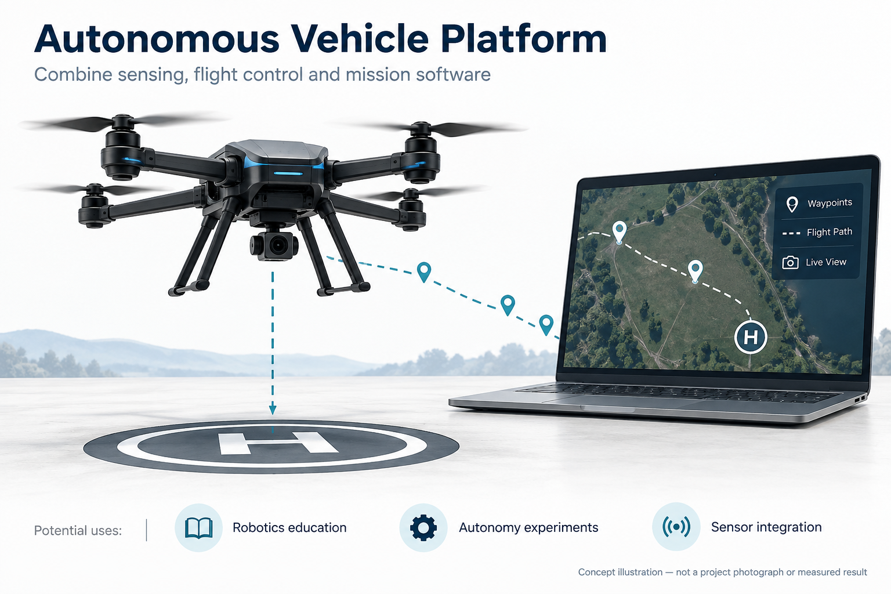
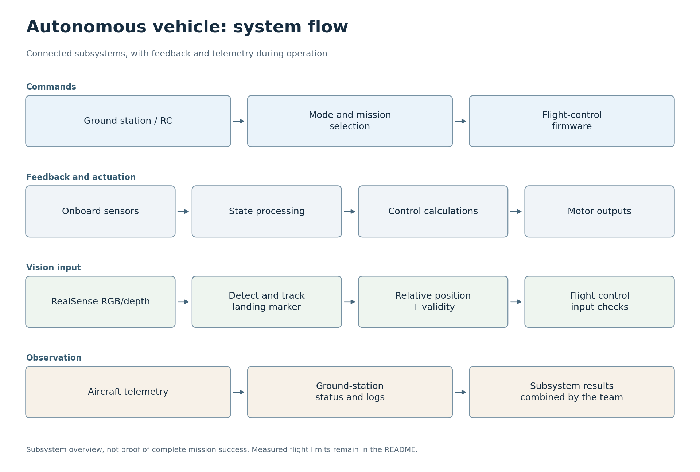
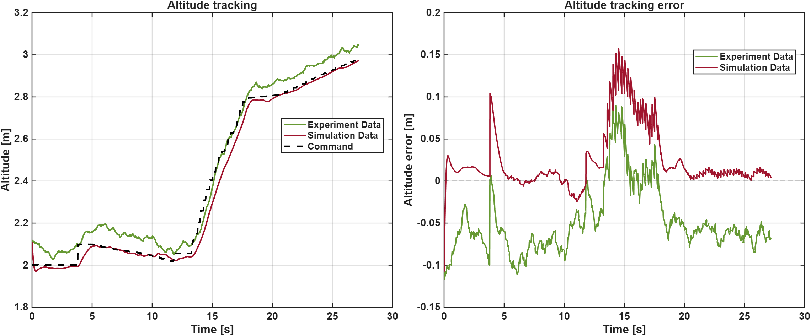
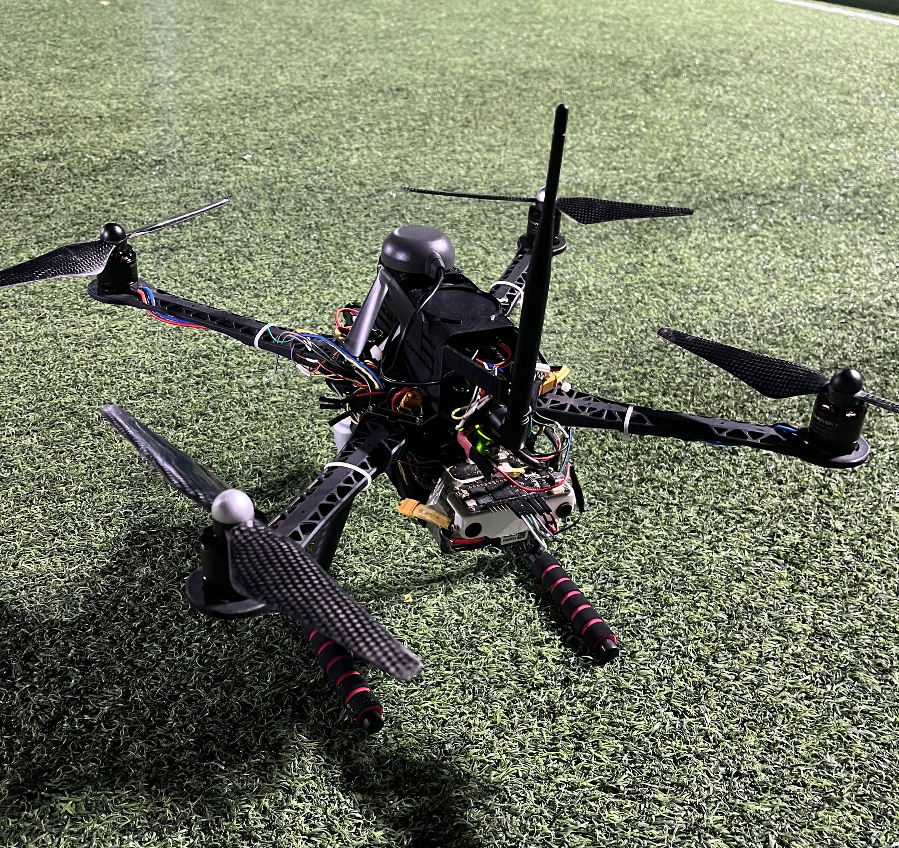

# 자율비행 드론

[한국어](#korean) · [English](#english)

<a id="korean"></a>
## 한국어

[코드 읽는 순서](#코드-따라-읽기)

2026년 1학기 자율주행체 제어 프로젝트에서 8명의 팀원이 기체 제작부터 제어, 비전, 지상관제까지 함께 개발한 쿼드로터입니다. RealSense 카메라가 착륙 표식을 관측하고, 그 위치와 유효성을 비행제어부에 전달해 자율 임무에 활용하는 시스템을 만들었습니다. 이 저장소는 팀 플랫폼과 박상헌의 비전 구현을 한곳에서 따라볼 수 있도록 정리한 프로젝트 아카이브입니다.

[비행 시연 영상](https://www.youtube.com/watch?v=GLonDTGTSmQ) · [팀 최종 보고서](development-report/final-report/AVC_26S_Final_Report.pdf)

### 프로젝트 목표와 활용

센서로 기체 상태를 파악하고, 제어기로 비행을 유지하며, 카메라가 제공하는 표적 정보를 이용해 착륙 목표에 접근하는 것이 목표였습니다. 지상관제 시스템은 명령 전달과 상태 확인을 맡습니다. 각 장치를 작동시키는 것에 더해, 서로 다른 하위 시스템이 같은 관측값의 의미와 사용 조건을 공유하도록 연결하는 데 초점을 두었습니다.



<sub>AI 생성 개념도</sub>

센싱·제어·비전을 함께 다루는 로보틱스 교육과 감독하의 자율 동작 실험에 활용할 수 있는 사례입니다. 표식과 깊이 정보를 결합하는 방식은 로봇 도킹이나 표적 기준 상대 위치 추정에도 응용할 수 있지만, 다른 장치에 적용하려면 별도의 보정과 검증이 필요합니다. 이 프로젝트에서 반복 가능한 정밀 착륙은 입증하지 못했습니다.

### 팀 구성과 담당 역할

| 담당 팀원 | 프로젝트에서 맡은 일 |
|---|---|
| 김예준 | 기체 하드웨어, 센서 처리와 비행제어 펌웨어, 자율 임무·경로 동작 |
| 임은결 | 기체 구조, 부품 배치, 조립·배선 등 하드웨어 개발 |
| 전세인 | 기체 하드웨어 개발, 팀 전체 결과 취합과 조율 |
| 이은석 | 기체 동역학 모델링·특성 측정, 제어기 설계·시뮬레이션 |
| 김유민 | 제어기 설계·시뮬레이션 |
| 이다원 | 제어기 설계·시뮬레이션 |
| **박상헌 · 비전 담당** | **영상 수집·라벨링 도구, 모델 비교와 SSDLite 학습·평가, NCNN 추론·LK 추적, 깊이 기반 상대 좌표, 관측 유효성 검사와 Uno Q 전달 인터페이스** |
| 이재용 | 지상관제 통신, 임무 인터페이스, 상태 표시·로깅 |

각 팀원은 담당 하위 시스템을 문서화했습니다. 원래 팀 아카이브 작성자는 김예준이며, 비전 구현과 실험 일부에는 AI 코딩 도구를 활용했습니다. 비전 기여의 출처와 배포 범위는 [귀속 문서](vision-system/ATTRIBUTION.md)에 정리되어 있습니다.

### 기체와 자율 임무

기체의 센서 측정값은 비행제어부로 들어가고, 제어 출력은 추진계로 전달됩니다. Arduino Uno Q를 포함한 제어 플랫폼에서 자율 임무와 센서 처리를 연결하며, 지상관제 시스템은 기체와 명령·상태 정보를 주고받습니다. 이때 비전은 모터를 직접 제어하는 대신, 비행제어부가 판단에 사용할 표적 관측값을 제공합니다.



문서와 코드를 바탕으로 정리한 시스템 개략도입니다. 구현은 [비행제어부](flight-controller), [지상관제 시스템](ground-control-station), 보조 연구인 [상보 필터](complementary-filter)에서 확인할 수 있습니다.

### 카메라 관측이 비행제어 입력이 되기까지

**RealSense 카메라 → 검출·추적·깊이 계산 → 관측 유효성 판정 → 컴패니언 브리지 → 비행제어**가 하나의 처리 흐름을 이룹니다. 박상헌의 비전 작업은 이미지에서 표식을 찾는 단계부터, 제어부가 그 관측을 사용할 수 있는지 구분해 전달하는 단계까지를 맡았습니다.


멀리 있는 헬리패드는 영상에서 작은 물체로 나타납니다. 이를 위해 영상 수집·라벨 검수·데이터 분리 도구를 마련하고, 작은 표식을 위한 512×512 SSDLite/MobileNetV3-Small 모델을 학습·평가했습니다. 온보드 실행에서는 NCNN으로 검출하고, 검출 사이 프레임은 Lucas–Kanade(LK) 광학 흐름으로 추적해 매 프레임 신경망을 실행하는 부담을 줄였습니다.

RealSense D435의 깊이값은 영상 속 표적을 상대 위치로 바꾸는 데 사용합니다. 카메라 장착 오프셋과 기울기를 반영해 기체 기준 전방·오른쪽·아래쪽(FRD) 정보를 계산하지만, 수평 자세를 가정한 측정 모델이므로 실제 제어에서는 기체 자세와 함께 해석해야 합니다.

좌표에는 사용 가능 여부도 따라갑니다. `LandingGate`는 최근 검출, 연속 유효 프레임, 위치 흔들림과 상자 크기 변화를 확인하며, **추적 예측만으로는 유효한 착륙 관측을 허가하지 않습니다.** [비전 실행 코드](vision-system/vision/track_helipad.py)는 최신 관측을 JSON으로 기록하고, [컴패니언 브리지](flight-controller/companion-vision-bridge/main.py)는 이를 읽어 `Bridge.notify`로 위치·거리·유효성을 전달합니다. 이전에 유효했던 관측이 오래되면 `valid=0`을 보내 마지막 좌표가 현재 표적으로 남지 않도록 합니다. 이후 표적 정보의 사용과 기체 제어는 팀 비행제어부가 담당합니다.

데이터·학습·평가·진단 코드는 `vision-system/`에 있으며, 브리지의 기준 소스는 `flight-controller/companion-vision-bridge/main.py`입니다. 자세한 실행 방법은 [비전 기술 문서](vision-system/README.ko.md), 좌표와 유효성 규칙은 [기술 요약](vision-system/docs/기술-요약.md)을 참고하세요.

### 기록된 결과와 한계

검출기 평가와 통합 비행은 서로 다른 수준의 결과입니다. 2026년 6월 27일 기록된 검출 평가는 **단일 클래스의 로컬 검증 영상 65장**을 사용했습니다. 신뢰도 0.5와 매칭 IoU 0.3에서 TP 61건, FP 0건, FN 4건이었습니다.

| 검출 지표 | 기록값 |
|---|### 코드 따라 읽기

아래 순서는 파일의 역할과 연결을 이해하기 위한 안내입니다. 독립 과제나 보드별 프로그램은 한꺼번에 실행하지 않고 해당 항목의 실행 안내를 따릅니다.

| 순서 | 파일 | 역할과 다음 단계 |
|---|---|---|
| 1 | [flight-controller/README.md](flight-controller/README.md) | 비행제어부의 디렉터리와 펌웨어 진입 구조부터 읽습니다. 세부 설치 안내는 이 문서의 연결을 따라갑니다. |
| 2 | [vision-system/tools/data-preparation](vision-system/tools/data-preparation) | 학습 전 영상 수집, 라벨링·검수, 데이터 분리 도구의 순서를 확인합니다. |
| 3 | [vision-system/training/train.py](vision-system/training/train.py) | 준비한 데이터와 모델 설정을 학습 단계에 연결합니다. 평가 도구는 별도 evaluation 폴더에 있습니다. |
| 4 | [vision-system/vision/track_helipad.py](vision-system/vision/track_helipad.py) | 실시간 검출·추적·깊이 정보가 관측값으로 정리되는 흐름을 읽습니다. |
| 5 | [flight-controller/companion-vision-bridge/main.py](flight-controller/companion-vision-bridge/main.py) | 비전 관측을 비행제어부에 전달하는 연결 지점입니다. 전체 시스템 설명과 메시지 경계를 함께 읽습니다. |
| 6 | [vision-system/README.ko.md](vision-system/README.ko.md) | 카메라와 학습 환경의 상세 준비 절차는 기존 기술 가이드를 그대로 참고합니다. |

---:|
| Precision | 100% |
| Recall | 93.8% |
| F1 | 96.8% |
| mAP@0.5:0.95 | 72.2% |


정밀도와 재현율은 위 단일 판정 임계값에서의 결과이며, mAP는 여러 IoU 임계값에 걸친 성능입니다. 이 수치는 해당 데이터셋의 검출 성능을 설명하며, 모든 고도·조명·배경이나 착륙 성공률을 대표하지 않습니다.

통합 비행에서는 착륙 목표에 접근했지만 정확한 표식 중심 착륙을 달성하지 못했습니다. **비전 락이 있었던 6회를 사후 분석했을 때 1회만 부분 성공 또는 성공에 근접한 사례로 분류**했습니다. 해당 시도는 약 0.643 m 고도까지 최신 비전 관측을 유지했고 헬리패드 잔차는 약 0.113 m였지만, 접지 전 제어기 수평 오차는 약 0.256 m 남았습니다. 나머지 5회는 하강 중 최신 관측을 잃거나 수평 오차가 남았습니다. 이 분류는 사후 분석 기준이며, **반복 가능한 정밀 착륙을 입증한 결과가 아닙니다.** [비행 평가 요약](vision-system/docs/flight-evaluation-summary.md)에 판정 조건을 설명했습니다.



팀 보고서에 포함된 실험·시뮬레이션 비교입니다. 추가 제어 결과는 [실험 기록](development-report/experiment-results)에서 볼 수 있습니다. 남은 과제는 저고도에서 최신 표적 관측을 유지하고, 자세를 반영한 좌표와 수평 제어 수렴을 함께 검증하는 것입니다.

### 실제 프로젝트 사진



팀 프로젝트의 실제 야외 시험 사진입니다. [추가 사진 2](assets/drone-photos/drone_field_02.jpg) · [추가 사진 3](assets/drone-photos/drone_field_03.jpg)

### 코드 살펴보기와 실행

비전 개발 과정을 따라가려면 [데이터 준비](vision-system/tools/data-preparation), [학습](vision-system/training), [평가](vision-system/evaluation) 순서로 읽을 수 있습니다. 하드웨어 없이 확인하는 명령은 저장소 루트에서 다음과 같습니다. 테스트 의존성은 [requirements-test.txt](vision-system/requirements-test.txt)에 있습니다.

```sh
cd vision-system
python -m pytest -q
python deployment/center_depth.py --self-test
```

[중앙 깊이 진단 도구](vision-system/deployment/center_depth.py)의 자체 검사는 카메라 연결 없이 실행됩니다. 이 README 작성에서는 위 테스트나 지상관제 빌드를 다시 실행하지 않았으며, 새 카메라·보드·비행 검증도 수행하지 않았습니다. 호스트 테스트는 카메라 타이밍, 깊이 품질, MCU 통신이나 폐루프 착륙을 재현하지 않습니다.

실제 카메라 추론에는 호환되는 RealSense/NCNN 환경이, 브리지에는 Uno Q Arduino App 실행 환경이 필요합니다. 원본 학습 데이터, 모델 가중치·NCNN 모델 파일, 개인 보정 정보와 원본 비행 로그는 비전 모듈에서 배포하지 않습니다. 자세한 준비 사항과 사용 범위는 [기술 문서](vision-system/README.ko.md)와 [배포 안내](vision-system/NOTICE.md)를 확인하세요.

<a id="english"></a>
## English

[Code walkthrough](#code-walkthrough)

This quadrotor was developed by an eight-member team for a university Autonomous Vehicle Control project in the first semester of 2026. The work brought together the aircraft, control system, vision and ground station: a RealSense camera observes the landing marker, then supplies its relative position and validity to the flight controller for autonomous missions. This archive brings the team platform and Sangheon Park's vision implementation together so that the complete path can be followed in one repository.

[Flight demonstration](https://www.youtube.com/watch?v=GLonDTGTSmQ) · [Team final report](development-report/final-report/AVC_26S_Final_Report.pdf)

### Project goal and applications

The goal was to sense the aircraft state, maintain flight through feedback control and approach a landing target using camera observations. The ground station handles commands and status monitoring. Alongside making each subsystem work, the project focused on connecting them through a shared understanding of what an observation means and when it can be used.

<sub>AI-generated concept illustration</sub>

The project offers an example for robotics education and supervised experiments combining sensing, control and vision. Marker detection with depth could also be adapted to robot docking or target-relative positioning, with separate calibration and validation for each new setup. Repeatable precision landing was not demonstrated in this project.

### Team and responsibilities

| Team member | Contribution to the project |
|---|---|
| 김예준 (Kim Yejoon) | Aircraft hardware, sensor processing and flight firmware, autonomous missions and path behaviour |
| 임은결 | Aircraft structure, component layout, assembly and wiring |
| 전세인 | Aircraft hardware; coordination and compilation of the team's results |
| 이은석 | Aircraft dynamics modelling and characteristic measurements; controller design and simulation |
| 김유민 | Controller design and simulation |
| 이다원 | Controller design and simulation |
| **박상헌 (Sangheon Park) · vision** | **Image capture and labelling tools, model comparisons and SSDLite training/evaluation, NCNN inference and LK tracking, depth-based relative coordinates, observation-validity checks and the Uno Q delivery interface** |
| 이재용 | Ground-station communications, mission interface, status display and logging |

Each member documented their subsystem. Kim Yejoon authored the original team archive; AI coding tools supported parts of the vision implementation and experiments. [Vision attribution](vision-system/ATTRIBUTION.md) records the origins and distribution scope of that contribution.

### Aircraft and autonomous missions

Aircraft sensor measurements enter the flight-control system, whose outputs drive the propulsion system. The control platform, including Arduino Uno Q, connects sensor processing with autonomous missions, while the ground station exchanges commands and status with the aircraft. Vision supplies target observations for the controller's decisions rather than issuing motor commands itself.


This schematic was reconstructed from the documentation and code. Implementation can be explored in the [flight controller](flight-controller), [ground station](ground-control-station) and supporting [complementary-filter study](complementary-filter).

### From a camera observation to flight-control input

**RealSense camera → detection, tracking and depth → observation validity → companion bridge → flight control** forms one processing path. Sangheon Park's vision work spans finding the marker through delivering an observation whose usability the controller can distinguish.


At a distance, the helipad occupies only a small part of the image. The work therefore included capture, label-review and dataset-splitting tools, followed by training and evaluation of a 512×512 SSDLite/MobileNetV3-Small model for small markers. Onboard, NCNN runs the detector and Lucas–Kanade (LK) optical flow tracks between detections, reducing the need to run the neural network on every frame.

Depth from the RealSense D435 converts the image target into relative position information. Camera mounting offset and tilt are applied to obtain forward-right-down (FRD) information in an aircraft-related frame. This measurement model assumes a level aircraft, so flight control must interpret it together with aircraft attitude.

Coordinates travel with a validity state. `LandingGate` checks recent detections, consecutive valid frames, position jitter and box-size changes; **tracking predictions alone cannot authorise a valid landing observation.** The [vision runtime](vision-system/vision/track_helipad.py) writes the latest observation as JSON. The [companion bridge](flight-controller/companion-vision-bridge/main.py) reads it and forwards position, distance and validity through `Bridge.notify`. When a previously valid observation becomes stale, the bridge sends `valid=0` so that the last coordinates do not remain a current target. The team's flight controller then owns the use of that information and the aircraft's response.

Data, training, evaluation and diagnostic code live under `vision-system/`; the canonical bridge source is `flight-controller/companion-vision-bridge/main.py`. See the [vision technical documentation in Korean](vision-system/README.ko.md) for detailed commands and the [technical summary](vision-system/docs/기술-요약.md) for coordinate conventions and validity rules.

### Recorded results and limits

Detector evaluation and integrated flight measure different levels of the system. The evaluation recorded on 27 June 2026 used **65 local validation images of one class**. At confidence 0.5 and matching IoU 0.3, it produced 61 true positives, no false positives and four false negatives.

| Detector metric | Recorded value |
|---|---:|
| Precision | 100% |
| Recall | 93.8% |
| F1 | 96.8% |
| mAP@0.5:0.95 | 72.2% |


Precision and recall use the single decision threshold above; mAP summarises performance across several IoU thresholds. These values describe the stated dataset, not performance across every altitude, lighting condition and background, or the success rate of landing.

In integrated flight, the team approached the target but did not achieve accurate marker-centre landing. **A retrospective review of six trials with vision lock classified only one as partial/near success.** That trial retained fresh vision to approximately 0.643 m altitude with about 0.113 m helipad residual, while the controller still reported about 0.256 m horizontal error before touchdown. The other five trials lost fresh observations during descent or retained horizontal error. These were post-hoc categories; **the results did not establish repeatable precision landing.** The [flight-evaluation summary](vision-system/docs/flight-evaluation-summary.md) explains the classification conditions.


This experiment/simulation comparison comes from the team report. Further control results are in the [experiment archive](development-report/experiment-results). Remaining work includes maintaining fresh low-altitude observations and validating attitude-aware coordinates together with horizontal-control convergence.

### Actual project photographs


An actual outdoor test photograph from the team project. [Additional photograph 2](assets/drone-photos/drone_field_02.jpg) · [Additional photograph 3](assets/drone-photos/drone_field_03.jpg)

### Exploring and running the code

To follow the vision development process, start with [data preparation](vision-system/tools/data-preparation), [training](vision-system/training) and [evaluation](vision-system/evaluation). From the repository root, the hardware-independent checks are below. Test dependencies are listed in [requirements-test.txt](vision-system/requirements-test.txt).

```sh
cd vision-system
python -m pytest -q
python deployment/center_depth.py --self-test
```

The [centre-depth diagnostic](vision-system/deployment/center_depth.py) can run its self-test without a connected camera. These tests and the ground-station build were not rerun for this README edit, and no new camera, board or flight validation was performed. Host tests do not reproduce camera timing, depth quality, MCU communications or closed-loop landing.

Camera inference requires a compatible RealSense/NCNN environment, and the bridge needs the Uno Q Arduino App runtime. The vision module does not distribute raw training data, model weights, NCNN model files, personal calibration or original flight logs. See the [technical documentation](vision-system/README.ko.md) and [distribution notice](vision-system/NOTICE.md) for preparation requirements and usage boundaries.
### Code walkthrough

Use this order to understand each file and its connections. Independent exercises and board targets are not one executable; follow the relevant run instructions below.

| Step | File | Role and next step |
|---|---|---|
| 1 | [flight-controller/README.md](flight-controller/README.md) | Begin with the controller layout and firmware entry points; follow its links for installation details. |
| 2 | [vision-system/tools/data-preparation](vision-system/tools/data-preparation) | Before training, follow capture, labelling, review and dataset splitting tools. |
| 3 | [vision-system/training/train.py](vision-system/training/train.py) | Connect prepared data and model settings to training; detector evaluation is a separate stage. |
| 4 | [vision-system/vision/track_helipad.py](vision-system/vision/track_helipad.py) | Follow detection, tracking and depth through to the resulting observations. |
| 5 | [flight-controller/companion-vision-bridge/main.py](flight-controller/companion-vision-bridge/main.py) | This is the handoff from vision observations to the controller; read it alongside the system and message documentation. |
| 6 | [vision-system/README.ko.md](vision-system/README.ko.md) | Keep the existing technical guide as the detailed reference for camera and training setup. |
