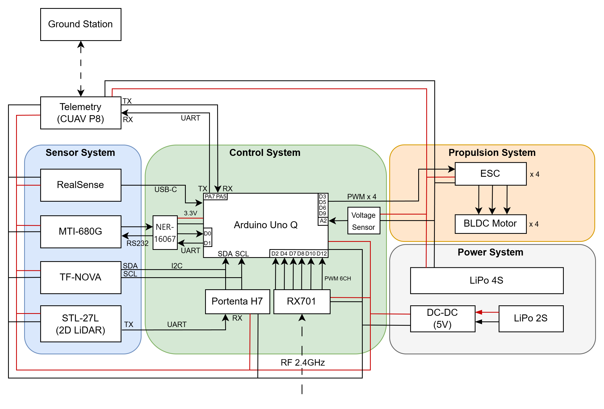
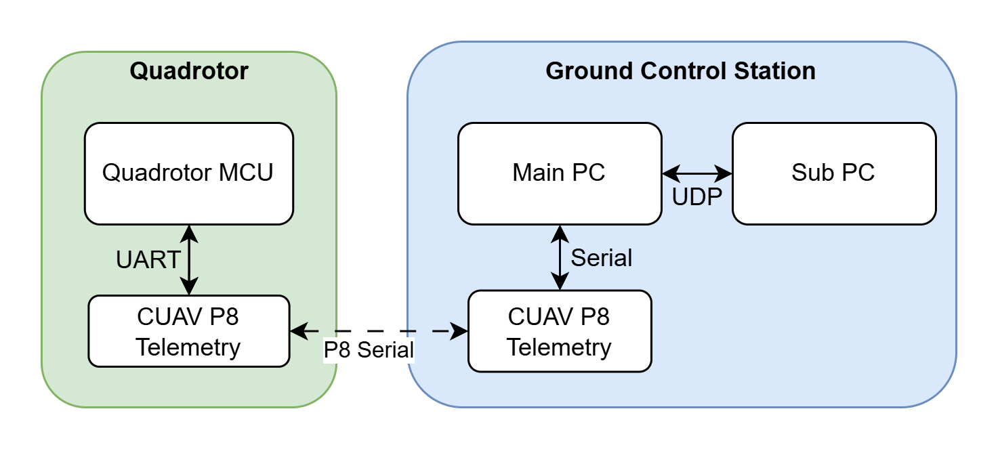
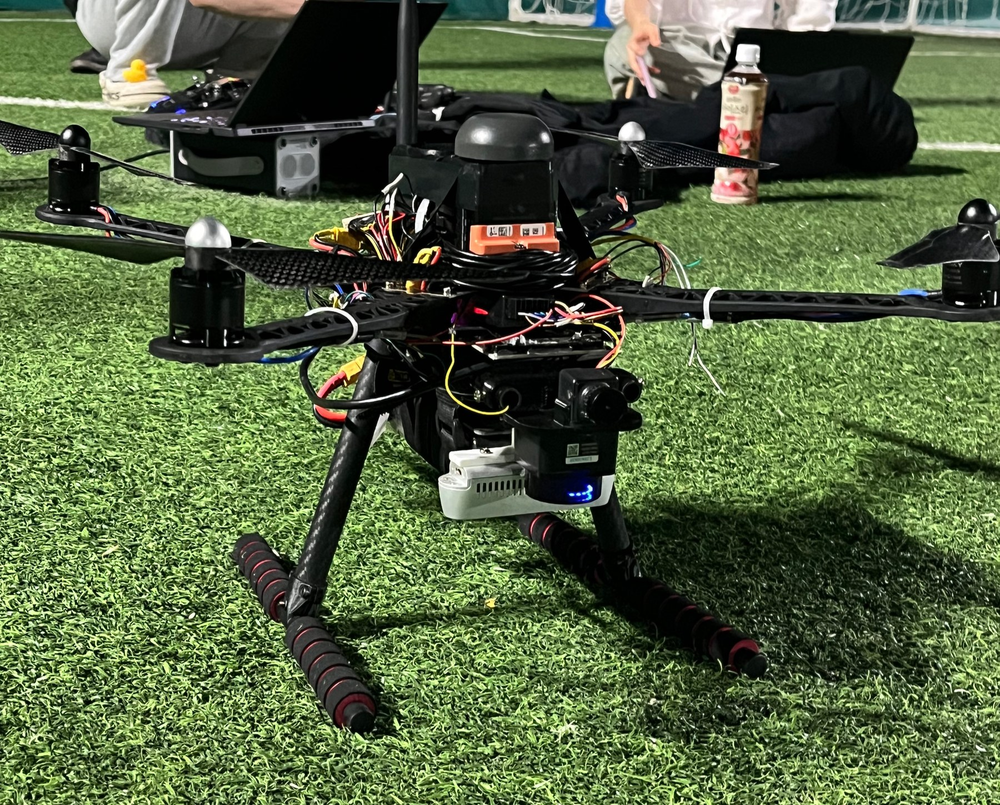
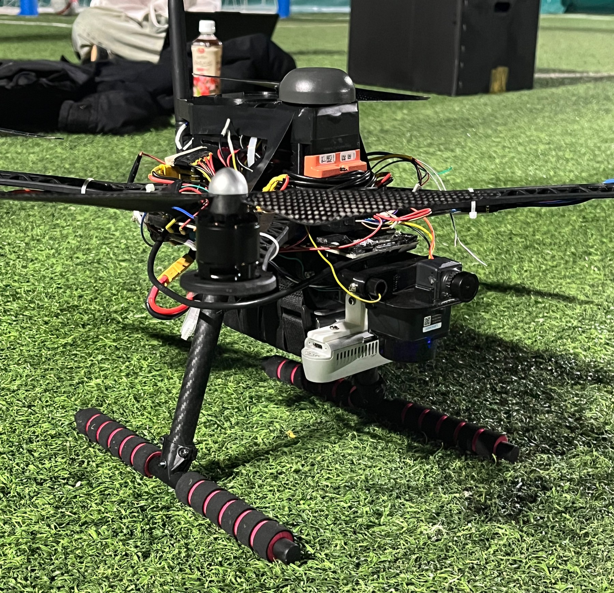
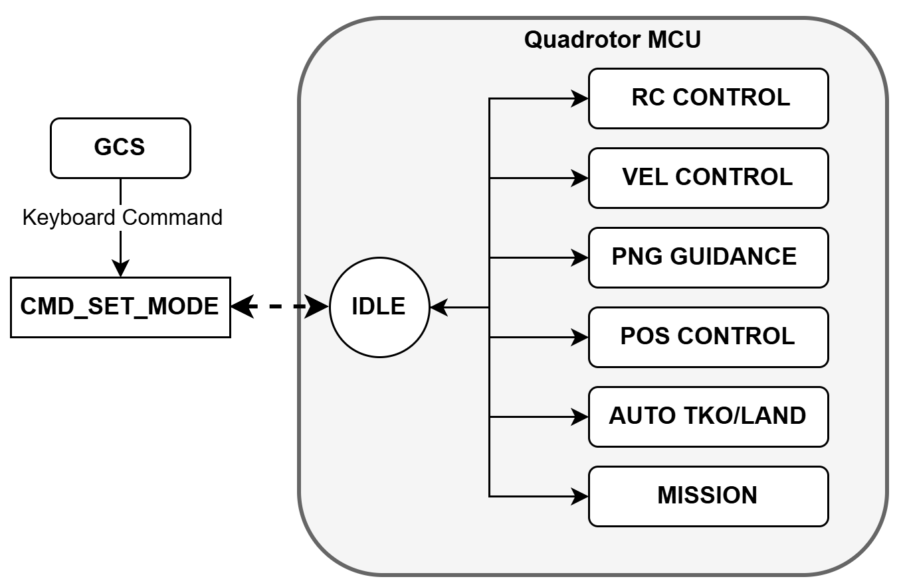
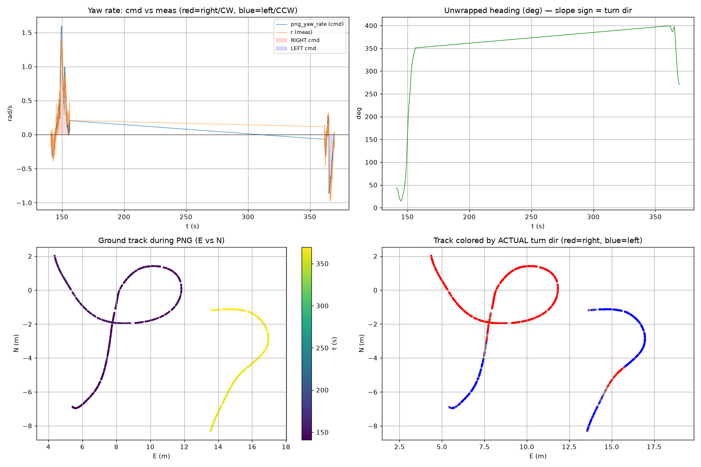
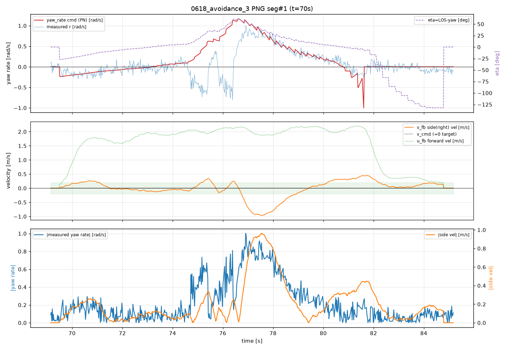
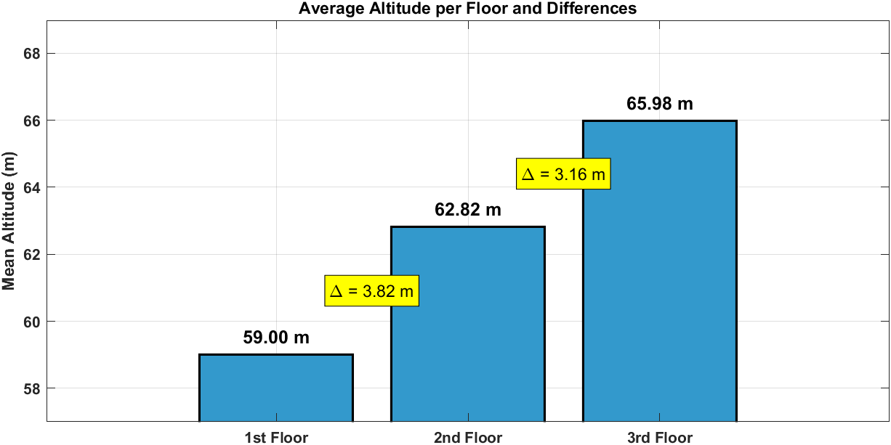

# Autonomous Drone Development

> Autonomous Vehicle Control 26S - quadrotor flight-control, ground-control, mission guidance, and vision-assisted landing development archive.


## Overview

This repository reorganizes the main development artifacts from an autonomous quadrotor project into a report-style engineering archive. The project integrates an Arduino UNO Q based flight controller, a Windows C++ ground-control station, onboard sensing, telemetry, mission guidance, and experimental validation data.

The original course folder contained assignments, robot-arm work, raw logs, CAD archives, and generated files. This repository keeps only the materials needed to explain and reproduce the autonomous drone development flow:

- flight-controller firmware and companion vision bridge
- GCS source code and waypoint tooling
- final report diagrams and representative experiment results
- complementary-filter study used as supporting sensor-fusion background

## System Snapshot



The system is organized around three communicating layers:

| Layer | Main Artifacts | Role |
|---|---|---|
| Quadrotor MCU | `flight-controller/unoq-firmware` | 200 Hz flight-control loop, RC/PWM handling, navigation state, control modes, telemetry |
| UNO Q Linux side | `flight-controller/companion-vision-bridge` | Runs helipad vision tracker and forwards target state to the MCU through Arduino Bridge |
| Ground Control Station | `ground-control-station` | Serial/UDP telemetry, waypoint mission upload, NTRIP correction, OptiTrack receive, ImGui dashboard, CSV logging |



Field prototype:

| Front payload view | Sensor and onboard stack |
|---|---|
|  |  |

## Repository Structure

```text
.
├─ flight-controller/
│  ├─ unoq-firmware/              # Arduino UNO Q MCU firmware
│  ├─ companion-vision-bridge/    # QRB2210/Linux-side helipad vision bridge
│  └─ docs/                       # Board migration and operation notes
├─ ground-control-station/        # C++/CMake/ImGui GCS
├─ development-report/
│  ├─ final-report/               # Final PDF report
│  ├─ system-architecture/        # System diagrams
│  └─ experiment-results/         # Curated result figures and summary CSVs
├─ complementary-filter/          # Supporting altitude/complementary-filter study
└─ assets/drone-photos/           # Field test photos
```

## Flight Controller

The flight controller is implemented under `flight-controller/unoq-firmware`. It targets the STM32U585 MCU on the Arduino UNO Q and coordinates sensing, state estimation, command handling, and motor output.

Key modules:

| Module | Responsibility |
|---|---|
| `sketch.ino` | Arduino entrypoint and top-level initialization |
| `hw_config.h` | Pin map, control frequency, telemetry frequency, gains, safety thresholds, mission constants |
| `Mode.cpp/h` | Main mode/state logic for RC control, velocity, PNG guidance, position control, auto takeoff/landing, mission execution |
| `Autopilot.cpp/h` | Attitude, altitude, climb-rate, velocity, position control, and thrust mixing |
| `INSS.cpp/h` | Navigation and sensor-state handling |
| `Telem.cpp/h` | Telemetry and debug-frame packing |
| `QuadPWM.cpp/h` | Motor PWM output |
| `RCInput.cpp/h` | RC channel input handling |
| `CollisionCone.cpp/h` | Obstacle-avoidance guidance logic |
| `filter.cpp/h` | Barometer altitude conversion, complementary filter, fading memory filter |

The firmware uses a 200 Hz control loop and 20 Hz telemetry/debug downlink. The mode logic combines manual RC control with autonomous behaviors such as waypoint guidance, auto takeoff, auto landing, and vision-assisted landing.



## Companion Vision Bridge

`flight-controller/companion-vision-bridge/main.py` runs on the UNO Q Linux/container side. It starts a helipad tracking process, reads the latest JSON telemetry packet, and forwards compact landing-target data to the MCU:

```text
helipad tracker -> latest JSON -> Bridge.notify("set_helipad_target", valid, x, y, xy, gnd)
```

This separates camera/vision workload from the MCU control loop while still allowing the landing controller to consume fresh target offsets.

## Ground Control Station

The GCS is a Windows C++20/CMake project in `ground-control-station`.

Key modules:

| Module | Responsibility |
|---|---|
| `gcs_main.cpp` | Main serial/UDP loop, keyboard commands, mission receive/save, CSV logging |
| `src/p8_comm.cpp`, `include/p8_comm.h` | P8 telemetry parser, debug frame parser, command packet sender |
| `src/dashboard.cpp`, `include/dashboard.h` | ImGui/OpenGL realtime dashboard |
| `src/ntrip_client.cpp` | NTRIP correction client |
| `src/OptiTrack.cpp` | OptiTrack UDP receiver |
| `WayPoint/*.txt` | Mission waypoint files |

The CMake project vendors only the minimum Dear ImGui files needed by the dashboard build. If the vendored folder is missing, the existing `CMakeLists.txt` can fetch ImGui v1.91.5.

Basic build on Windows:

```powershell
cd ground-control-station
cmake -S . -B build
cmake --build build --config Release
```

## Experiment Results

Representative result figures and summary CSVs are placed in `development-report/experiment-results`. Raw CSV logs were intentionally excluded because the original dataset is large; this repo keeps curated evidence suitable for review.

### Mission Guidance




### PNG Guidance And Yaw Response




The final mission summary files record mission duration, guidance time, landing time, waypoint count, range metrics, loop timing, RTK/GNSS availability, vision usage, and mission state transitions:

- `development-report/experiment-results/Final_mission_validation_summary.csv`
- `development-report/experiment-results/Final_vision_landing_summary.csv`

## Complementary Filter Study

The `complementary-filter` folder preserves the supporting MATLAB/Simulink work used to study altitude estimation from barometer and IMU-related data.



Included materials:

- MATLAB scripts for complementary-filter analysis
- Simulink models for filter experiments
- sampled pressure/altitude logs
- floor/barometer result plots
- original presentation slide deck

This section is kept as a technical appendix rather than a separate project because it supports the altitude-estimation and sensor-fusion logic used by the drone controller.

## Report

The final project report is archived here:

- `development-report/final-report/AVC_26S_Final_Report.pdf`

The report covers project goals, mission definition, hardware design, dynamics modeling, parameter modeling, controller design, mission implementation, and experimental validation.

## Notes On Excluded Files

The original working directory contained raw flight logs, large CAD/STEP/STL files, generated build folders, executable artifacts, backup folders, and unrelated course/project materials. They were intentionally excluded from this repository to keep it focused and GitHub-friendly.

Excluded categories include:

- full raw CSV log dump
- large CAD archives and duplicated zip files
- generated build folders and IDE metadata
- executable/runtime binaries
- unrelated assignments and robot-arm project files

## Author

Kim Yejoon - Autonomous Vehicle Control project archive.
