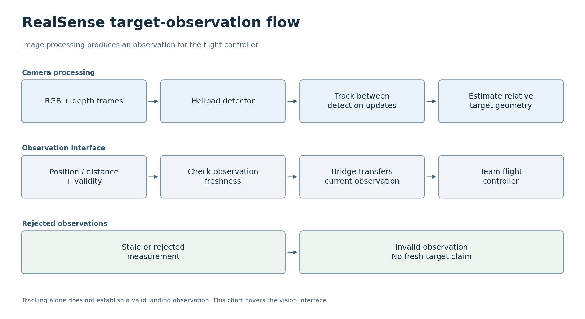

# 착륙 표식 인식 · 자율비행 드론 구성요소

[한국어](#korean) · [English](#english)

<a id="korean"></a>
## 한국어

이 저장소는 [자율비행 드론 프로젝트](https://github.com/oldprize47-SH/Autonomous_Drone_Development)의 비전 구성요소 코드입니다. 전체 프로젝트 설명과 이 구성요소의 설명은 대표 문서에서 함께 읽을 수 있습니다. 기존 코드 경로와 기술 문서는 이곳에 유지합니다.

이 프로젝트는 대학 자율비행 드론 프로젝트의 비전 구성요소입니다. RealSense 영상에서 헬리패드를 검출하고 추적하며, 관측 결과에 깊이 정보를 결합해 비행 제어기에 표적의 상대 위치 정보를 전달합니다. 기체, 제어 시스템, 지상관제 시스템과 비행 실험에 관한 내용은 [팀 저장소](https://github.com/oldprize47-SH/Autonomous_Drone_Development)에 설명되어 있습니다.

[한국어 상세 문서](README.ko.md)

### 프로젝트 목표

카메라 영상에서 헬리패드의 위치를 찾고, 팀의 비행 제어기가 확인하고 사용할 수 있는 표적 상대 위치 정보를 제공합니다.


AI로 생성한 개념도입니다. 장치의 외형, 인터페이스 배치와 예시 그래픽은 설명을 위한 것으로, 프로젝트에서 촬영한 사진이나 측정 결과가 아닙니다.

### 활용할 수 있는 분야

표식 검출, 깊이 정보, 관측 유효성 검사를 결합한 방식은 로봇 도킹이나 실험실에서 수행하는 표적 기준 상대 위치 추정 실험에 맞게 응용할 수 있습니다. 제어기는 표적 관측값과 함께 그 관측값을 사용할 수 있는지 판단하는 데 필요한 정보를 받게 됩니다. 표식, 카메라 배치 또는 로봇이 달라지면 각각에 맞는 보정과 검증이 필요합니다. 표식이 검출되었다는 사실만으로 도킹이나 착륙 동작이 완료되었다고 볼 수는 없습니다.

### 한눈에 보기



프로젝트 문서와 코드를 바탕으로 재구성한 개요입니다. 결과와 검증의 한계는 아래에 설명합니다. [SVG](docs/flowcharts/vision.svg)

### 시스템 구성과 팀 역할

Sangheon Park(박상헌)은 영상 수집과 라벨링, 모델 비교, 임베디드 추론, 검출과 추적, 표적 정보 인터페이스 등 비전 구성요소를 담당했습니다. 김예준은 비행 펌웨어와 자율 임무를, 이재용은 지상관제 시스템을 담당했습니다. 기체 하드웨어는 김예준, 임은결, 전세인이 개발했고, 모델링은 이은석이, 제어 설계는 이은석, 김유민, 이다원이 담당했습니다. 전세인은 각 부분의 결과를 종합하고 조율했으며, 각 팀원은 자신이 담당한 하위 시스템을 문서화했습니다. 비전 구현과 실험의 일부에는 AI 코딩 도구의 도움을 받았습니다.

### 검출과 표적 관측

기체가 멀어질수록 착륙 표식이 영상에서 차지하는 픽셀 수는 줄어듭니다. 따라서 기체에 탑재된 컴퓨팅 자원의 한도 안에서 작은 표적을 검출할 수 있어야 합니다. 또한 출력에는 측정값이 최신이며 사용 가능한지를 비행 제어기에 알려 주는 정보가 필요합니다. 이 작업에서는 라벨링된 영상, 모델 비교, 임베디드 추론과 추적을 결합해 이러한 관측 정보가 연속적으로 전달되도록 했습니다.

### 구현

카메라는 Intel RealSense D435입니다. SSDLite/MobileNetV3-Small을 NCNN으로 실행하며, 검출 프레임 사이에는 LK 광학 흐름을 사용합니다. 깊이 측정값으로 표적의 상대적인 기하 정보를 구합니다. Uno Q 브리지가 표적 위치 오프셋을 비행 제어기로 전달하기 전에 유효성 검사를 통해 오래된 관측값을 배제합니다.

주 실행 코드는 [vision/track_helipad.py](vision/track_helipad.py)이며, 브리지는 [bridge/main.py](bridge/main.py)입니다. 데이터 준비, 학습과 평가는 각각 [tools/data-preparation](tools/data-preparation), [training](training), [evaluation](evaluation)에 정리되어 있습니다.


왼쪽은 이 저장소에서 관리하는 비전 처리 파이프라인을 설명합니다. 오른쪽은 팀의 비행 제어기 영역입니다. 이 도식은 처리 과정과 인터페이스를 설명하는 것이며, 정밀 착륙에 성공했다는 결과를 나타내지 않습니다.

#### 영상에서 표적 관측값을 얻기까지

검출기는 RGB 영상에서 헬리패드의 위치를 찾습니다. 검출기가 결과를 갱신하는 사이에는 Lucas–Kanade(LK) 광학 흐름이 영상 특징점을 따라가며 표적 위치를 유지하므로, 매 프레임마다 신경망을 실행하지 않아도 됩니다. 깊이 영상은 검출된 표적 주변의 거리 측정값을 제공하며, 실행 코드는 영상과 깊이 관측값을 표적 상대 위치 정보로 변환합니다.

유효성 검사는 좌표만큼 중요합니다. 실행 코드는 검출기 관측값의 경과 시간과 일관성을 확인합니다. 추적 결과만으로는 유효한 착륙 관측값으로 인정하지 않습니다. 브리지는 최신 JSON 레코드를 읽고 관측값을 Uno Q 애플리케이션으로 전달합니다. 마지막 좌표를 여전히 읽을 수 있다는 이유만으로, 오래되었거나 유효성 검사에서 거부된 관측값을 최신 표적 정보로 취급해서는 안 됩니다.

코드를 검토할 때는 [vision/track_helipad.py](vision/track_helipad.py)부터 살펴본 뒤, 그 출력이 [bridge/main.py](bridge/main.py)로 전달되는 과정을 따라가면 됩니다. [기술 문서](docs/기술-요약.md)에는 좌표 규약과 유효성 규칙이 설명되어 있습니다. 이러한 규칙은 비전 인터페이스의 일부이며, 전체 기체가 안전하게 착륙할 수 있다는 증거는 아닙니다.

### 결과


기록된 평가에는 단일 클래스의 로컬 검증 영상 65장을 사용했습니다. 신뢰도 임계값 0.5와 매칭 IoU 임계값 0.3에서 참양성은 61건, 거짓양성은 0건, 거짓음성은 4건이었습니다. 정밀도는 100%, 재현율은 93.8%, F1은 96.8%였으며, mAP@0.5:0.95는 72.2%였습니다.

정밀도는 검출기가 보고한 검출 결과 중 실제로 올바른 결과의 비율을, 재현율은 라벨링된 표적 중 검출기가 찾아낸 표적의 비율을 나타냅니다. mAP는 여러 겹침 임계값에 걸친 검출 성능을 요약하므로, 위에서 제시한 단일 임계값의 정밀도·재현율과는 다른 지표입니다.

이 결과는 해당 검증 데이터셋에 한정됩니다. 모든 비행 조건에서의 성능을 입증하지는 않습니다. 비전 락이 확보된 6회의 시도를 사후 검토한 결과, 1회가 부분 성공 또는 성공에 근접한 사례로 분류되었습니다. 반복 가능한 정밀 착륙은 입증되지 않았습니다. 기록된 조건은 [비행 평가](docs/flight-evaluation-summary.md)를 참고하세요.

### 실행과 테스트

이 저장소는 학습 데이터, 모델 가중치, NCNN 모델 파일이나 개인별 보정 정보를 배포하지 않습니다. 카메라 추론에는 호환되는 RealSense/NCNN 환경이 필요하며, 브리지에는 Arduino Uno Q 실행 환경이 필요합니다.

하드웨어에 의존하지 않는 테스트는 다음 명령으로 실행할 수 있습니다.

```sh
python -m pip install -r requirements-test.txt
python -m pytest -q
```

[deployment/center_depth.py](deployment/center_depth.py)는 2026년 9월 28일 로컬 Uno Q 도구에서 가져와 추가했습니다. 이 도구는 카메라 진단을 위해 영상 중심의 깊이를 출력합니다. 하드웨어 없이 수행하는 검사 명령은 `python deployment/center_depth.py --self-test`입니다. 이 검사와 호스트 테스트 17개가 모두 통과했습니다. 기존에 공개된 실행 코드와 JSON 브리지 검사는 로컬 사본에 없는 변경 사항을 포함하고 있어 그대로 유지했습니다.

[한국어 상세 README](README.ko.md)에는 데이터 구성과 학습, 평가, 실행 명령이 정리되어 있습니다. 호스트 테스트는 카메라, MCU 또는 비행 시스템을 재현하지 않습니다. 이번 문서 갱신을 위해 새로 수행한 카메라 테스트나 비행 테스트는 없습니다.

#### 시작 지점 선택

하드웨어 없이 프로젝트를 이해하려면 저장된 평가 결과를 읽고 호스트 테스트를 실행하세요. 카메라를 사용하려면 전체 추론 파이프라인을 실행하기 전에 RealSense 의존성과 독립 실행형 깊이 진단 도구를 먼저 확인하세요. 검출기를 학습하거나 평가하려면 호환되는 라벨링 데이터와 모델 파일을 직접 준비해야 합니다. 저장소의 스크립트에는 이러한 자료가 포함되어 있지 않습니다.

테스트 의존성 목록은 호스트 검사를 위한 것이며, 전체 학습 환경이나 보드 실행 환경을 모두 포함하지 않습니다. 호스트 테스트 통과는 테스트에서 확인한 소프트웨어 동작 규약이 예상대로 작동한다는 뜻입니다. 카메라 타이밍, 깊이 품질, 추론 속도나 팀의 비행 결과를 재현한다는 뜻은 아닙니다.

출처 표기와 배포 제한 사항은 [ATTRIBUTION.md](ATTRIBUTION.md)와 [NOTICE.md](NOTICE.md)에 설명되어 있습니다.

### 보관된 프로젝트 예시


보관된 라벨링 헬리패드 영상으로 표적의 모습을 보여 줍니다. 상자는 라벨링 예시이며, 새로 얻은 검출기 결과가 아닙니다.

---

<a id="english"></a>
## English

**Landing Marker Vision**

This is the vision-code component of the [Autonomous Drone Project](https://github.com/oldprize47-SH/Autonomous_Drone_Development). The main README explains the whole project and this component together. Existing source paths and technical documentation remain here.

This is the vision component of a university autonomous-drone project. It detects and tracks a helipad in RealSense images, combines the observation with depth information and sends relative target information to the flight controller. The [team repository](https://github.com/oldprize47-SH/Autonomous_Drone_Development) describes the aircraft, control system, ground station and flight experiments.

[한국어 상세 문서](README.ko.md)

### Project goal

Locate a helipad in camera images and provide relative target information that the team flight controller can check and use.


AI-generated concept illustration. Device appearance, interface layout and example graphics are illustrative, not project photographs or measured results.

### Where it could be used

The combination of marker detection, depth information and observation-validity checks could be adapted to robot docking or a laboratory target-relative positioning experiment. A controller would receive a target observation together with information needed to judge whether it is usable. Each new marker, camera arrangement and robot would need its own calibration and validation; a detected marker alone does not demonstrate a completed docking or landing manoeuvre.

### At a glance


Overview reconstructed from the documented project and code. Results and verification limits are described below. [SVG](docs/flowcharts/vision.svg)

### System configuration and team

Sangheon Park (박상헌) handled the vision component: image collection and labelling, model comparisons, embedded inference, detection and tracking, and the target-information interface. 김예준 handled flight firmware and autonomous missions, and 이재용 handled the ground-control station. The aircraft hardware was developed by 김예준, 임은결 and 전세인; modelling by 이은석; and control design by 이은석, 김유민 and 이다원. 전세인 coordinated the combined results, with each member documenting their own subsystem. AI coding tools supported parts of the vision implementation and experiments.

### Detection and target observations

The landing marker occupies fewer pixels when the aircraft is farther away. Detection therefore needs to handle small targets within the onboard computing budget. Its output also needs to tell the flight controller whether a measurement is recent and usable. The work combined labelled images, model comparisons, embedded inference and tracking to produce that observation stream.

### Implementation

The camera is an Intel RealSense D435. SSDLite/MobileNetV3-Small runs through NCNN, with LK optical flow between detection frames. Depth measurements provide relative target geometry. A validity check rejects stale observations before the Uno Q bridge forwards target offsets to the flight controller.

The main runtime is [vision/track_helipad.py](vision/track_helipad.py), and the bridge is [bridge/main.py](bridge/main.py). Data preparation, training and evaluation are kept in [tools/data-preparation](tools/data-preparation), [training](training) and [evaluation](evaluation).


The left side describes the vision pipeline maintained in this repository. The right side belongs to the team's flight controller. The diagram describes the processing and interface, not a successful precision-landing result.

#### From an image to a target observation

The detector locates the helipad in the RGB image. Between detector updates, Lucas–Kanade (LK) optical flow follows image features to maintain the target location without running the neural network on every frame. The depth image supplies a distance measurement near the detected target, and the runtime converts the image/depth observation into relative target information.

The validity checks matter as much as the coordinates. The runtime checks the age and consistency of detector observations; tracking alone does not authorise a valid landing observation. The bridge reads the latest JSON record and forwards the observation to the Uno Q application. A stale or rejected observation must not be treated as a fresh target just because the last coordinates remain available.

For a code review, start with [vision/track_helipad.py](vision/track_helipad.py), then follow the output into [bridge/main.py](bridge/main.py). The [technical notes](docs/기술-요약.md) explain the coordinate conventions and validity rules. These rules are part of the vision interface, not proof that the complete aircraft can land safely.

### Results


The recorded evaluation used 65 local validation images of one class. At confidence 0.5 and matching IoU 0.3, the detector found 61 true positives, with no false positives and four false negatives. Precision was 100%, recall 93.8% and F1 96.8%; mAP@0.5:0.95 was 72.2%.

Precision describes how many reported detections were correct; recall describes how many labelled targets were found. The mAP value summarises detection performance across several overlap thresholds, so it is a different measure from the single-threshold precision and recall above.

These results apply to that validation set. They do not establish performance under all flight conditions. A retrospective review of six trials with vision lock classified one as partial/near success. Repeatable precision landing was not demonstrated. See the [flight evaluation](docs/flight-evaluation-summary.md) for the recorded conditions.

### Running and testing

The repository does not distribute training data, model weights, NCNN model files or personal calibration. Camera inference needs a compatible RealSense/NCNN setup, and the bridge requires the Arduino Uno Q runtime.

Hardware-independent tests can be run with:

```sh
python -m pip install -r requirements-test.txt
python -m pytest -q
```

[deployment/center_depth.py](deployment/center_depth.py) was added from the local Uno Q tools on 28 September 2026. It reports centre depth for camera diagnostics. Its hardware-free check is `python deployment/center_depth.py --self-test`. That check and all 17 host tests passed. The existing published runtime and JSON bridge checks were retained because they contain changes beyond the local copies.

The [detailed Korean README](README.ko.md) contains the data layout and training, evaluation and runtime commands. Host tests do not reproduce the camera, MCU or flight system. No new camera or flight test was performed for this documentation update.

#### Choosing a starting point

To understand the project without hardware, read the saved evaluation and run the host tests. To work with a camera, first check the RealSense dependencies and the standalone depth diagnostic before attempting the complete inference pipeline. To train or evaluate a detector, prepare your own compatible labelled data and model files; the repository's scripts do not supply those assets.

The test requirements cover the host checks, not the full training or board environment. A passing host test means the exercised software contract behaves as expected. It does not reproduce camera timing, depth quality, inference speed or the team's flight results.

Source credits and distribution restrictions are described in [ATTRIBUTION.md](ATTRIBUTION.md) and [NOTICE.md](NOTICE.md).

### Archived project example


An archived labelled helipad image illustrates the target. The box is an annotation example, not a new detector result.
