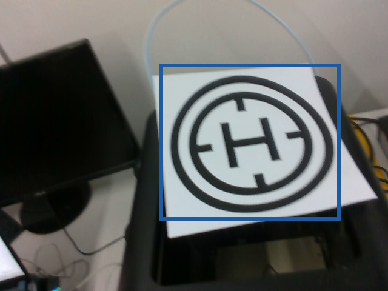
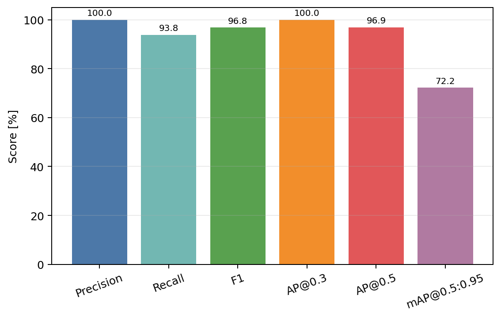
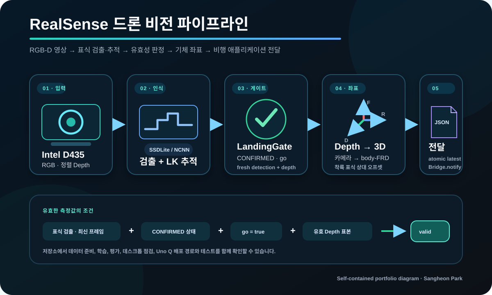

# RealSense 기반 헬리패드 비전 착륙 기술 요약

이 문서는 수업 제출 보고서 원문을 공개하는 대신, 저장소에 포함된 코드와 검증 자료만으로
개인 기여 범위와 기술적 판단을 설명하는 포트폴리오용 요약이다. 팀 문서, 학번·이름이 포함된
자료, 원본 데이터, 비행 영상과 비공개 로그는 포함하지 않았다.

## 1. 해결하려던 문제

드론 하부의 Intel RealSense D435로 헬리패드를 탐지하고, 깊이값을 결합해 기체 중심 기준의
수평 오차를 비행 제어 측으로 전달하는 것이 목표였다. 실제 환경에서는 다음 문제가 있었다.

- 고도에 따라 헬리패드가 매우 작은 물체로 보인다.
- 매 프레임 검출을 수행하면 Uno Q의 처리 지연이 커진다.
- 검출이 잠시 끊겼을 때 과거 좌표를 유효한 표적으로 계속 보내면 위험하다.
- 카메라 좌표와 비행 제어가 사용하는 body FRD(forward-right-down) 좌표가 다르다.
- 검출 정확도와 실제 폐루프 착륙 성공은 동일한 지표가 아니다.

## 2. 개인 구현 범위와 팀 경계

### 개인 구현 범위

- RealSense RGB/depth 수집과 카메라 intrinsics 기록
- HEIC 변환, 4점 라벨링, 자동 라벨, 수동 검수, train/validation 분리 도구
- 512×512 SSDLite + MobileNetV3-Small 학습과 소형 물체용 anchor 구성
- 로컬 validation의 precision/recall/F1/AP/mAP 평가와 그래프 생성
- NCNN detector와 LK optical flow를 결합한 실시간 추적
- fail-closed `LandingGate`, 깊이 deprojection, level-body FRD 오차 계산
- atomic latest-JSON telemetry와 Uno Q Arduino App `Bridge.notify` 전달
- stale telemetry 무효화, 기록/로그 분석과 병목 계측

### 팀 범위

- 기체 프레임, 추진·전원·배선, 전체 기구/전장 통합
- STM/flight-controller 상태기계와 최종 제어기
- 팀 전체의 시험 운영과 수업 제출 산출물

따라서 이 저장소는 비전에서 생성한 **advisory target**까지를 설명하며, 팀 전체 기체나
비행제어 소스의 단독 소유를 주장하지 않는다.

## 3. 데이터 준비와 학습

데이터 도구는 `tools/data-preparation/`에 단계별로 정리했다.
라벨 파일은 정규화된 5열 bounding-box 텍스트 형식을 사용하지만 학습 모델은 SSDLite이며,
별도 YOLO/IMX500 실험 코드는 포함하지 않았다.

1. `convert_heic.py` — 휴대전화 HEIC를 EXIF 회전 보정 후 JPG로 변환한다.
2. `capture_frames.py` — D435의 RGB와 정렬 가능한 depth를 함께 수집하고 intrinsics를 기록한다.
3. `label_four_points.py` — 원형 표식의 상·하·좌·우 네 점으로 bounding box를 만든다.
4. `auto_label.py` — 이전 학습 weight로 새 사진을 자동 라벨링한다.
5. `review_labels.py` — 자동 라벨을 승인·수정·삭제한다.
6. `split_dataset.py` — train/validation 폴더를 재현 가능한 seed로 다시 나눈다.

학습기는 TorchVision SSDLite와 MobileNetV3-Small을 사용한다. 입력을 512×512로 확대하고,
초기 feature-map부터 작은 정사각형 표식을 받을 수 있도록 anchor scale을
`0.040, 0.080, 0.160, 0.260, 0.400, 0.600, 0.850`으로 구성했다. 회전·밝기/대비·좌우
반전 augmentation을 적용하고, 3 epoch linear warm-up 후 cosine learning-rate schedule을 썼다.



> 그림 1. 네 점 클릭으로 생성한 헬리패드 라벨 예시. 실제 학습 데이터는 공개하지 않는다.


> 그림 2. 기록된 두 번의 320 px 학습과 최종 512 px 학습의 best validation loss 비교.
> 서로 다른 run의 요약이며 동일 조건의 통제 실험으로 해석하지 않는다.

## 4. 실시간 추적과 fail-closed 설계

매 프레임 SSDLite 추론을 수행하지 않고 주기적 detector와 LK optical flow를 결합했다.
검출 사이 프레임은 추적기가 bounding box를 갱신하지만, 추적 예측만으로는 착륙 advisory를
유효하게 만들 수 없다. `LandingGate`는 최근 detector 관측, 연속 유효 프레임, jitter,
면적 변화와 detection age를 함께 확인한다.

표적 중심 depth는 RealSense deprojection을 통해 카메라 좌표의 3차원 점으로 변환한다.
카메라 장착 오프셋과 전방 tilt를 적용해 level-body FRD의 forward/right/down과 수평 오차를
계산한다. 이 값은 자세가 수평이라는 제한된 측정 모델이므로, 실제 비행 제어에서는
roll/pitch/yaw와 함께 융합해야 한다.

## 5. Uno Q 전달 계약

`vision/track_helipad.py`는 compact JSON을 임시 파일에 쓴 뒤 원자적으로 latest 파일을
교체한다. `bridge/main.py`는 파일 freshness와 필드를 검사하고 다음 계약으로 전달한다.

```text
Bridge.notify(
  "set_helipad_target",
  valid,
  helipad_x_m,
  helipad_y_m,
  helipad_xy_distance_m,
  drone_ground_distance_m,
)
```

이전에 유효했던 packet이 stale 상태가 되면 bridge는 `valid=0`을 한 번 전송한다. 즉,
마지막으로 보았던 표적을 현재 관측처럼 재사용하지 않는다. 하드웨어 없이 실행되는 계약 테스트가
fresh packet forwarding과 stale invalidation을 검증한다.

## 6. 제한된 로컬 검증 결과

아래 수치는 2026-06-27에 기록된 **단일 클래스, 65장 로컬 validation set** 결과다.
confidence 0.5와 matching IoU 0.3에서 TP 61, FP 0, FN 4였으며, AP 계산 때만 순위 보존을
위해 모델 post-processing score threshold를 0.001로 낮췄다.

| 지표 | 값 |
|---|---:|
| Precision | 100.0% |
| Recall | 93.8% |
| F1 | 96.8% |
| Mean IoU (matched) | 86.6% |
| AP@0.3 | 100.0% |
| AP@0.5 | 96.9% |
| mAP@0.5:0.95 | 72.2% |



> 그림 3. 65장 로컬 validation 결과. 외부 독립 데이터, 다중 클래스, 장거리 비행 환경의
> 일반화 성능을 입증하는 수치가 아니다.



> 그림 4. 저장소에 포함된 본인 구현 코드를 바탕으로 직접 제작한 전체 처리 흐름. 외부
> 이미지 없이 RGB-D 입력부터 측정 유효성 판정과 비행 애플리케이션 전달까지를 요약했다.

## 7. 비행 결과와 남은 과제

사후 분석한 비전 lock 보유 비행 6회 중 하나만 `partial success / near`로 분류했다. 해당
trial은 약 0.643 m까지 fresh vision을 유지하고 헬리패드 residual이 약 0.113 m였지만,
touchdown 전 제어기의 수평 오차가 약 0.256 m 남았다. 나머지 다섯 번은 하강 중 fresh
vision이 사라지거나 수평 오차가 남았다.

이는 반복 정밀착륙 성공이 아니다. 남은 핵심 과제는 다음과 같다.

- 저고도에서 fresh detection을 유지하는 데이터·광학·추론 개선
- 기체 자세를 반영한 카메라→body/NED 좌표 변환
- detector/track freshness와 제어기 수렴을 함께 보는 사전 정의된 합격 기준
- 더 많은 독립 비행 trial과 고도·조명·배경별 validation

## 8. 공개·재현 범위

저장소는 알고리즘과 하드웨어 독립 테스트를 제공하지만 다음은 제공하지 않는다.

- 학습 weight와 raw train/validation 이미지
- 개인 calibration과 flight/runtime log
- 팀 flight-controller/STM 소스와 기체 설계 파일
- Uno Q 보드 전용 NCNN/RealSense/Arduino App 런타임 패키지

따라서 데스크톱에서는 테스트, 데이터 준비, 학습·평가 코드를 검토할 수 있다. 실제 camera,
NCNN runtime, bridge와 폐루프 비행은 호환 하드웨어와 별도 artifact가 있어야 재현된다.
