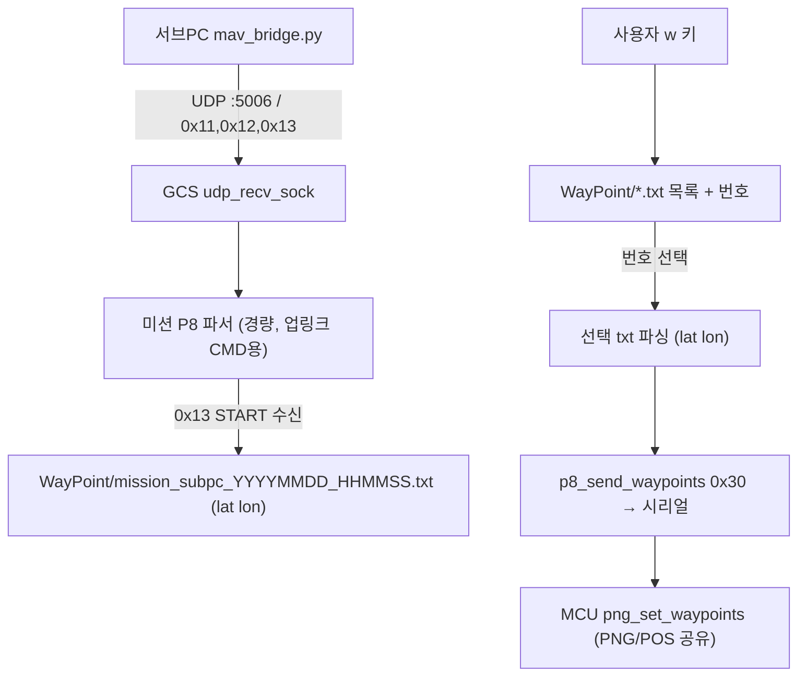

# GCS 통합 계획 — 미션 수신/업로드 + ImGui 대시보드 + 서브PC 텔레메트리 보강

## 목표 / 범위
**GCS(`C:\Users\Jun\CLionProjects\GCS`)만 수정.** MCU(sketch)와 서브PC(mav_bridge.py)는 변경하지 않는다.
세 가지를 한 작업으로 진행:

1. **미션 수신 → txt 저장 → w 선택 업로드** (서브PC UDP 미션을 파일로 기록 후 수동 업로드).
2. **ImGui 실시간 대시보드** (DebugFrame 전 그룹을 별도 GUI 창에 게이지+숫자로).
3. **서브PC 텔레메트리 보강** (TelemFrame JSON 송신 유지하되 값을 DebugFrame에서 채워 단위 변환).

## 핵심 결정 (사용자, 확정)
- MCU 비행 모드 추가 안 함. 서브PC/미션 프로토콜은 GCS가 흡수. 서브PC mav_bridge.py 무수정.
- 미션 수신 시 **매번 타임스탬프 새 파일** 저장. w 키 = `WayPoint/*.txt` **목록 표시 후 번호 선택** 업로드.
- 저장 txt 포맷 **alt 제외** (`lat lon` 2컬럼).
- GCS MODE_NAMES는 **MCU FlightMode 기준**: 0=IDLE 1=RC_CONTROL 2=RTK_MAIN 3=PWM_TEST
  4=MTI_TEST 5=ESC_CAL 6=VEL_CONTROL 7=PNG_GUIDANCE 8=POS_CONTROL (jaeyong의 MISSION/AUTO_LAND 미채택).
- 서브PC 송신: **TelemFrame UDP JSON 포맷/키 유지** (서브PC 무수정), 단 **값은 DebugFrame에서** 채움.
- 소스는 전부 DebugFrame 기준. ImGui 대시보드 항목은 권장안 그대로 전 그룹.

---

## 작업 1. 미션 수신 → txt 저장 → w 선택 업로드

### 프로토콜 (서브PC mav_bridge.py와 정합, 확인 완료)
- 서브PC UDP(rx-port 5006)로 P8 프레임 전송: `CMD_MISSION_COUNT 0x11` → `CMD_MISSION_ITEM 0x12 ×N` → `CMD_MISSION_START 0x13`.
- `0x12` payload = `<B i i i>` = `idx, lat_1e7, lon_1e7, alt_mm` (13B). GCS는 lat/lon만 취하고 alt 버림.
- 업로드는 기존 `CMD_SET_WAYPOINTS 0x30` (lat/lon, 8B) 그대로. MCU 무변경.

### 흐름

### 구현
- `include/p8_comm.h`: `CMD_MISSION_COUNT 0x11`, `CMD_MISSION_ITEM 0x12`, `CMD_MISSION_START 0x13`, `CMD_MISSION_CLEAR 0x14` 추가.
- `gcs_main.cpp`:
  - 커맨드라인 인자 `--ip/--tx-port/--rx-port` (기본 192.168.0.74 / 5005 / 5006), tx 14555→5005.
  - `udp_recv_sock` (rx-port 바인드, non-blocking) 추가.
  - 메인 루프에서 수신 바이트를 **미션 전용 경량 파서**에 먹임 (jaeyong의 단순 시리얼 릴레이 대신 파싱·저장).
    - 0x11 → 버퍼 초기화·count 저장, 0x12 → idx/lat/lon 누적, 0x13 → `save_mission_txt()`.
  - `save_mission_txt(lat[], lon[], n)` → `../WayPoint/mission_subpc_YYYYMMDD_HHMMSS.txt` (localtime), 헤더 주석 + `lat lon` 한 줄씩.
  - `case 'w'` 교체: `WayPoint/*.txt` 목록 (`FindFirstFile/FindNextFile`) 번호 출력 → `scanf` 번호 선택 → 파싱 후 `p8_send_waypoints`.

---

## 작업 2. ImGui 실시간 대시보드

### 표시 항목 (DebugFrame 전 그룹, 그룹별 패널)
- **자세**: roll/pitch/yaw(deg), p/q/r, roll_cmd/pitch_cmd/r_cmd, rate_cmd, e_roll/e_pitch
- **고도**: alt_est, alt_baro, lidar_alt(valid), alt_hold, alt_cmd/error, hdot_cmd, w_down, h_used/v_used
- **속도**: u_cmd/u_fb/u_err, v_cmd/v_fb/v_err
- **위치(PNG/POS)**: png_px/py(NED), png_rng, png_eta, wp_idx, png_lat/lon/alt
- **토크·모터**: U1~U4, F1~F4
- **시스템**: batt_mv, rtk_status, gnss_fix, loop_count_50hz, loop_dt_max_ms, uptime
- 숫자 + 막대/게이지(가시화용), 색상 강조(예: rtk fixed=초록).

### 통합 방식 (의존성) — 확정
- **Dear ImGui + Win32 + DirectX11 백엔드** (Windows 네이티브, 외부 SDK 설치 불필요).
- ImGui 소스는 **CMake FetchContent**로 빌드 시 자동 fetch (저장소에 vendoring 안 함).
  첫 빌드 시 인터넷 필요 (사용자 환경 인터넷 연결 확인됨).
- **ImGui 렌더는 별도 UI 스레드** (60FPS), DebugFrame은 공유 구조체(뮤텍스)로 전달 —
  GCS 리얼타임 루프(500Hz idle)와 분리.
- `CMakeLists.txt`: FetchContent로 imgui 받고 imgui 코어 + backends(imgui_impl_win32, imgui_impl_dx11)
  컴파일, `d3d11.lib dxgi.lib d3dcompiler.lib` 링크.

### 데이터 전달
- 메인 루프가 DebugFrame 수신 시 최신값을 전역 `g_latest_debug`(뮤텍스 보호)로 복사.
- UI 스레드가 60FPS로 읽어 렌더. 끊겨도(디버그 OFF) 마지막 값 유지 + "stale" 표시.

---

## 작업 3. 서브PC 텔레메트리 보강 (DebugFrame → TelemFrame JSON)

### 현재
- gcs_main이 **TelemFrame 수신 시** UDP JSON 송신 (키: time/lat/lon/alt/roll/pitch/yaw/yaw_rate/vel_n/e/u/batt_mv). 서브PC mav_bridge.py가 이 키를 파싱.

### 변경 (서브PC 무수정 — 키/포맷 그대로, 소스만 DebugFrame)
- **DebugFrame 수신 시** 동일 JSON 키로 UDP 송신하도록 추가. 값은 DebugFrame에서 단위 변환:
  - roll/pitch/yaw: DebugFrame은 **rad → deg** (`× 57.2958`).
  - yaw_rate: DebugFrame `r`(rad/s) → deg/s (`× 57.2958`).
  - lat/lon/alt: DebugFrame `png_lat/png_lon/png_alt`.
  - vel_n/vel_e: DebugFrame `vel_n/vel_e`. vel_u: DebugFrame엔 직접 없음 → `-w_down`(up+) 사용 (1차).
  - batt_mv: DebugFrame `batt_mv`. time: `uptime_ms/1000`.
- TelemFrame JSON 송신은 **유지** (폴백). DebugFrame 수신 시에도 동일 키로 송신.
  둘 다 같은 키라 서브PC는 구분 없이 최신값 사용.

### 주의
- DebugFrame `png_lat/png_lon`은 PNG/POS + fix일 때만 채워지고 그 외 0 → fix 없을 때 서브PC 지도가 (0,0)로 튐.
  완화: png_lat==0이면 직전 유효 lat/lon 유지(GCS가 last-good 캐시). 1차 구현에 포함.

---

## 변경 파일 요약
| 파일 | 변경 |
|---|---|
| `GCS/include/p8_comm.h` | CMD_MISSION_* 추가, MODE_COUNT 9 + POS_CONTROL |
| `GCS/src/p8_comm.cpp` | MODE_NAMES에 POS_CONTROL 추가 |
| `GCS/gcs_main.cpp` | UDP 수신+미션 파서/txt 저장, w 목록선택, DebugFrame→JSON 송신, ImGui 데이터 공유 |
| `GCS/src/dashboard.cpp` (신규) | ImGui Win32+DX11 대시보드 UI 스레드 |
| `GCS/include/dashboard.h` (신규) | 대시보드 인터페이스 + 공유 DebugFrame |
| `GCS/CMakeLists.txt` | FetchContent로 imgui + backends, d3d11/dxgi/d3dcompiler 링크, dashboard.cpp 추가 |

## 위험 / 주의
- **ImGui 빌드 통합**이 가장 무거움 (FetchContent + CMake + DX11 링크). 먼저 최소 창 띄우기 검증 후 위젯 채움.
- 비행 중 업로드 차단은 **이번 범위 아님**(추후). w 안 누르면 안 올라감.
- DebugFrame vel_u/png_lat 0 처리 등 단위·결측 보정 필요 (위 명시).
- 타임스탬프 미션 파일 누적 → 정리는 사용자 몫.

## 구현 순서 (제안)
1. p8_comm 모드명/CMD 상수 (작고 안전).
2. 미션 수신 파서 + txt 저장 + w 목록선택 (작업 1 완결, 빌드·동작 확인).
3. DebugFrame→JSON 송신 보강 (작업 3).
4. ImGui 대시보드 (작업 2, 가장 무거움 — 최소창→위젯 순).
