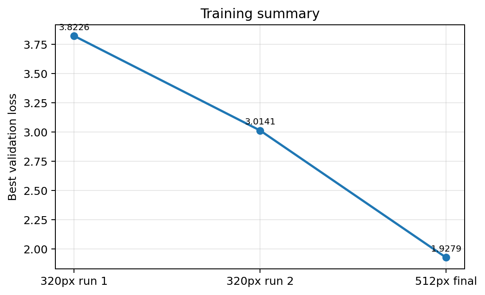

# 비전 실행·학습 기술 가이드

[프로젝트 설명](../README.md) · [빠른 실행 안내](README.md)

아래 명령은 `vision-system` 디렉터리에서 실행합니다. 카메라·모델·보드가 필요한 단계와 호스트에서 확인할 수 있는 단계를 나누어 살펴보시면 좋습니다.

## 관측값 처리

`LandingGate`는 최근 detector 관측, 연속 유효 프레임, jitter, box 면적 변화와 detection
age를 함께 확인합니다. tracker-only 예측은 화면상 추적을 이어갈 수는 있지만 `valid=1`을
허가하지 않습니다.

## 데이터 준비 → 학습 → 평가


> 네 점을 클릭해 원형 헬리패드의 bounding box를 만든 예시입니다. 원본 학습 데이터는
> 개인정보와 용량·사용권 때문에 공개하지 않습니다.

### 1. 데이터 준비

```bash
# 선택: 휴대전화 HEIC를 JPG로 변환
python tools/data-preparation/convert_heic.py \
  --src ./heic-input --dst ./data/images

# D435 RGB/depth 캡처(pyRealSense2가 설치된 데스크톱)
python tools/data-preparation/capture_frames.py --output-dir ./data

# 수동 라벨 또는 기존 모델을 이용한 자동 라벨 후 검수
python tools/data-preparation/label_four_points.py \
  --image-dir ./data/images --label-dir ./data/labels
python tools/data-preparation/auto_label.py \
  --img-dir ./data/images --label-dir ./data/labels --weights ./weights/best.pth
python tools/data-preparation/review_labels.py

# 재현 가능한 train/validation 분리
python tools/data-preparation/split_dataset.py --data-dir ./data --seed 42
```

데이터를 준비할 때는 아래 기본 레이아웃을 참고할 수 있습니다. `data/`는 Git에서 제외됩니다.
라벨은 정규화된 5열 bounding-box 텍스트 형식을 사용하지만, detector는 SSDLite이며
YOLO/IMX500 학습·배포 코드는 이 저장소에 섞지 않았습니다.

```text
data/
├── images/                 # 분리 전 RGB pool
├── labels/                 # YOLO 형식 label pool
├── depth/                  # 선택적 16-bit depth
├── train/{images,labels}/
└── val/{images,labels}/
```

### 2. SSDLite 512 학습

```bash
python training/train.py \
  --data-dir ./data \
  --output-dir ./weights \
  --epochs 80 \
  --batch-size 16 \
  --seed 42
```

학습기는 512×512 입력, 작은 정사각형 물체를 여러 feature-map level에서 받는 custom
anchor, 회전·밝기/대비·좌우반전 augmentation, 3 epoch warm-up과 cosine schedule을
사용합니다.



> 기록된 두 번의 320 px run과 최종 512 px run의 best validation loss입니다. 서로 다른
> run의 요약이므로 동일 조건 통제 실험으로 과대 해석하지 않습니다.

### 3. 로컬 detector 평가

```bash
python evaluation/evaluate_detector.py \
  --data-dir ./data \
  --weights ./weights/best.pth \
  --output-dir ./output/evaluation
```

2026-06-27에 기록한 결과는 **단일 클래스, 로컬 validation 65장/GT 65개**에 한정됩니다.
confidence 0.5와 matching IoU 0.3에서 detection/TP 61, FP 0, FN 4였습니다. AP 계산 시에는
순위 보존을 위해 모델 post-processing score threshold를 0.001로 낮췄으며, 이는 비행
runtime의 허용 임계값이 아닙니다.

| 지표 | 기록값 |
|---|---:|
| Precision | 100.0% |
| Recall | 93.8% |
| F1 | 96.8% |
| Mean IoU (matched) | 86.6% |
| AP@0.3 | 100.0% |
| AP@0.5 | 96.9% |
| mAP@0.5:0.95 | 72.2% |


> 이 수치는 독립 외부 데이터, 다중 클래스, 고도·조명·배경 전체의 일반화나 폐루프 착륙
> 성공률을 의미하지 않습니다.

## NCNN 런타임 → Uno Q bridge

실행을 준비할 때는 학습 weight, NCNN `.param`/`.bin`, 개인 calibration을 별도로 마련해야 합니다.
이 자료는 공개하지 않습니다. 호환 artifact와 RealSense/NCNN 런타임이 준비되면 다음 형태로 실행할 수 있습니다.

```bash
python vision/track_helipad.py \
  --param ./models/ssdlite_v3small_helipad.param \
  --bin ./models/ssdlite_v3small_helipad.bin \
  --headless --no-log \
  --telemetry latest --telemetry-format stm \
  --telemetry-path ./output/helipad-latest.json
```

`vision/track_helipad.py`는 compact packet을 임시 파일에 쓴 뒤 latest JSON을 원자적으로
교체합니다. Uno Q의 `../flight-controller/companion-vision-bridge/main.py`는 subprocess와 파일 freshness를 감시하고 다음 계약으로
비행 제어 측에 전달합니다.

```text
Bridge.notify(
  "set_helipad_target",
  valid,
  helipad_x_m,
  helipad_y_m,
  helipad_xy_distance_m,
  drone_ground_distance_m,
)
```

이전에 유효했던 packet이 stale이 되면 `valid=0`을 한 번 전송해 마지막 관측값이 현재 표적으로
남지 않게 합니다. 실제 bridge 실행에는 Uno Q Arduino App runtime이 필요합니다.

PC에서 학습 weight를 시각 점검하거나 camera stage 지연을 계측할 수도 있습니다.

```bash
python demo/desktop_demo.py --weights ./weights/best.pth
python deployment/bench_camera.py --frames 150
```

## 비행 평가 경계

기존 비행 로그를 보수적인 사후 기준으로 분석했을 때, vision lock이 있었던 6회 중 하나만
**partial success / near**로 분류했습니다. 해당 trial은 약 0.643 m 고도까지 fresh vision을
유지했고 helipad residual은 약 0.113 m였지만, touchdown 전 제어기의 수평 오차가 약
0.256 m 남았습니다. 다른 다섯 번은 하강 중 fresh vision이 사라지거나 수평 오차가 남았습니다.

이 기록에서는 반복 정밀착륙 성공까지 입증되지 않았습니다. 결과를 해석하는 데 필요한 자세한 판정 규칙은
[비행 평가 요약](docs/flight-evaluation-summary.md)에 있습니다.

## 저장소 구조

```text
.
├── ../flight-controller/companion-vision-bridge/main.py                       # Uno Q tracker 감시·Bridge.notify 전달
├── vision/
│   ├── inference.py                     # SSD anchor/box decode/NMS·NCNN 진단 경로
│   └── track_helipad.py                 # D435, detector/LK, gate, depth/FRD, telemetry
├── tools/data-preparation/
│   ├── convert_heic.py
│   ├── capture_frames.py
│   ├── label_four_points.py
│   ├── auto_label.py
│   ├── review_labels.py
│   └── split_dataset.py
├── training/train.py                    # SSDLite 512 학습
├── evaluation/evaluate_detector.py      # one-class local 평가/그래프
├── demo/desktop_demo.py                 # PC RealSense 실시간 시각 점검
├── deployment/bench_camera.py           # Uno Q 배포 병목 계측
├── docs/
│   ├── 기술-요약.md
│   ├── flight-evaluation-summary.md
│   └── images/                          # 자체 제작 개요도와 검증 결과 이미지 4개
├── tests/                               # hardware-independent 계약/회귀 테스트
├── requirements-test.txt
├── requirements-pipeline.txt
├── ATTRIBUTION.md
└── NOTICE.md
```

## 설치와 검증

### 하드웨어 독립 테스트

```bash
python -m venv .venv
# Windows: .venv\Scripts\activate
# Linux/macOS: source .venv/bin/activate
python -m pip install -r requirements-test.txt
python -m pytest -q
```

테스트는 debug metrics, 비차단 video recorder, tracker-only fail-closed gate, compact packet
validity, bridge forwarding, stale invalidation, 새 포트폴리오 파일의 portable-path/secret-output
계약과 Python compilation을 검사합니다.

### 데이터·학습·평가 도구

```bash
python -m pip install -r requirements-pipeline.txt
```

`requirements-pipeline.txt`는 데이터 준비·PyTorch 학습·평가·시각화 의존성입니다.
RealSense 카메라 도구에는 호환되는 `pyrealsense2`/librealsense 설치가 추가로 필요합니다.
Uno Q 배포에는 보드 이미지가 제공하는 NCNN Python binding, RealSense runtime과 Arduino App
runtime이 필요하므로 일반 pip requirements로 고정하지 않았습니다.

## 제한 사항

- 모델 weight, raw image/depth, calibration, 비행 로그를 배포하지 않습니다.
- PyTorch→NCNN 변환 artifact는 본 저장소에 포함하지 않으며, 실제 target runtime에서 별도
  검증이 필요합니다.
- level-body FRD 측정은 기체 자세를 완전히 보정하지 않습니다. flight controller가
  roll/pitch/yaw를 융합해야 합니다.
- 데스크톱 테스트는 RealSense, Uno Q container, MCU bridge와 폐루프 비행을 재현하지 않습니다.
- detector validation 결과와 비행 성공률은 분리해 해석해야 합니다.
- 저고도 fresh vision과 반복적인 수평 수렴은 아직 해결해야 할 과제입니다.

## 출처와 사용 범위

팀 산출물, 다른 팀원 코드, 얼굴이 보이는 montage, 비행 영상, 수업 보고서와 개인 식별정보는
포함하지 않았습니다. 코드·이미지별 출처와 범위는 [ATTRIBUTION.md](ATTRIBUTION.md), 공개
제한은 [NOTICE.md](NOTICE.md)에서 확인할 수 있습니다. 제3자 라이브러리는 각 소유자의 라이선스를 따릅니다.

## 보관된 프로젝트 자료


보관된 헬리패드 라벨 예시입니다. 표시된 상자는 새 검출 실험 결과가 아닙니다.
